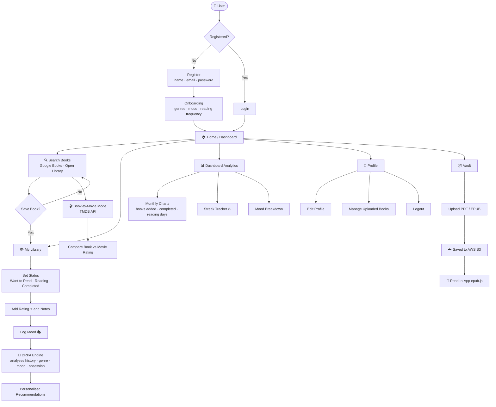

# 📚 BookNest+

> A smart, personalized reading platform to discover, track, and manage books — powered by mood, behavior, and your reading obsessions.


---

## 🌐 Live URLs

| URL | Purpose |
|-----|---------|
| [https://d2t9ocwr95ejyv.cloudfront.net](https://d2t9ocwr95ejyv.cloudfront.net) | 🌍 Frontend — S3 + CloudFront (HTTPS, CDN) |
| http://13.201.69.202 | ⚙️ Backend API — EC2 Mumbai + Fallback |

---

## 🌿 Branches

| Branch | Description |
|--------|-------------|
| `main` | Stable / mirrored code |
| `master` | Active development — **push here triggers auto-deploy** |

> **Note:** Pushing to `master` automatically triggers the CI/CD pipeline and deploys to production.

---

## 🌟 Overview

**BookNest+** is a full-stack reading platform that combines:

- 🔍 **Book Discovery** — Search across Google Books and Open Library
- 📚 **Personal Library Management** — Organise your collection, wishlist, and reading progress
- 📊 **Reading Analytics** — Visualise your habits, streaks, and monthly progress
- 🧠 **Intelligent Recommendations** — Personalised picks via the DRPA engine

---


## 🗺️ Application Flowchart



## ✨ Features

### 🔍 Book Discovery
- Search books using **Google Books API** and **Open Library API**
- View covers, metadata, descriptions, and ratings
- Save books directly to your personal library

### 📚 Personal Library
- **My Collection** — All saved books in one place
- **Wishlist** — Books you want to read
- Organised reading status management

### 📊 Reading Tracker
- `Want to Read` → `Currently Reading` → `Completed`
- Track progress across multiple books simultaneously

### ⭐ Ratings & Notes
- Rate books from 1–5 stars
- Add personal notes and reflections per book

### 📦 Personal Book Vault
- Upload **PDF** and **EPUB** files
- Private, secure file storage (S3-backed on AWS `ap-south-1`)
- Access your uploaded books anytime

### 📖 In-App Reading
- **EPUB** reading powered by `epub.js`
- Smooth, browser-native reading experience with session tracking

### 🔗 Smart Availability
- Read via **Open Library** / **Internet Archive**
- Purchase links via **Kindle / Google Books** integration

### 📊 Dashboard & Analytics
- Monthly reading charts (books added, completed, reading days)
- Streak detection (last 7 days)
- Mood-based reading activity breakdown

### 🎯 Current Obsession
- Auto-detects your most-read genre or author
- Generates obsession-specific book recommendations

### 🎭 Mood-Based System
- Log reading moods per book (😊 😢 ❤️ ⚡ ☕ 🤔 🎉 😴 🤯 😍 🤗)
- Get mood-matched book suggestions

### 🎬 Book-to-Movie Mode
- Detect movie adaptations via **TMDB API**
- Compare book vs. movie ratings
- View posters and film details

### 👤 User Profile ("Me" Section)
- View & edit profile (name, email, gender, birthday)
- Manage uploaded books
- Onboarding flow with genre/mood/frequency preferences
- Secure JWT-based authentication

---

## 🧠 Core Algorithm — DRPA

### 🔥 Dynamic Reading Preference Algorithm

A custom recommendation engine that analyses:

| Signal | Description |
|--------|-------------|
| 📖 Reading history | Last 20 completed books with ratings |
| 🎯 Genre preferences | Set during onboarding |
| 🎭 Mood trends | Last logged reading mood |
| 🧠 Obsession tracking | User-set or auto-detected current obsession |
| 🔁 Reading frequency | Daily / Weekly / Monthly preference |

Outputs a **personality type** (e.g., *The Voracious Reader*, *The Deep Thinker*) and a curated set of recommendations.

---

## 🧱 Tech Stack

### 💻 Frontend
| Tech | Purpose |
|------|---------|
| React 18 + TypeScript | UI framework |
| Vite | Build tool |
| React Router | Client-side routing |
| Tailwind CSS | Styling |
| Framer Motion | Animations |
| Lucide React | Icons |
| epub.js | In-browser EPUB reader |

### ⚙️ Backend
| Tech | Purpose |
|------|---------|
| Node.js + Express | REST API server |
| TypeScript (via tsx) | Type-safe backend, runs directly |
| Multer | File uploads (PDF/EPUB) |
| AWS S3 (`ap-south-1`) | Cloud file storage |

### 🐳 Containerization
| Tech | Purpose |
|------|---------|
| Docker (`node:20-slim`) | Container runtime with glibc for better-sqlite3 |
| Docker Compose | Single-container orchestration, port 80→5000 |

### ☁️ AWS Infrastructure
| Service | Purpose |
|---------|---------|
| S3 (`booknest-app-uploads`) | Frontend hosting + PDF/EPUB file storage |
| CloudFront (`d2t9ocwr95ejyv`) | CDN, HTTPS, OAC security, global edge caching |
| EC2 (`13.201.69.202`, Mumbai) | Backend API host, Docker container |
| IAM (`booknest-ec2-s3-role`) | EC2 instance profile for S3 access |

### 🔐 Auth
| Tech | Purpose |
|------|---------|
| JSON Web Tokens (JWT) | Session management |
| bcryptjs | Password hashing |

### 🗄️ Database
| Tech | Purpose |
|------|---------|
| SQLite | Local relational DB |
| better-sqlite3 | Sync SQLite bindings |

### 🔗 External APIs
| API | Usage |
|-----|-------|
| Google Books API | Book search, covers, metadata |
| Open Library API | Additional book data |
| TMDB API | Movie adaptations, posters, ratings |

---

## ☁️ Deployment Architecture

```
User
 │
 ▼
CloudFront (HTTPS + CDN)          ← https://d2t9ocwr95ejyv.cloudfront.net
 │   OAC (Origin Access Control)
 ▼
S3 Bucket                         ← React dist/ (HTML, CSS, JS)
 │
 │  API calls
 ▼
EC2 Instance (Mumbai)             ← http://13.201.69.202
 │   Docker Container (port 80→5000)
 ▼
Express API (Node.js + TypeScript)
 │
 ├── SQLite DB (bookhaven.db)
 └── S3 Bucket                    ← PDF/EPUB uploads (booknest-app-uploads)
```

---

## 🔄 CI/CD Pipeline

Fully automated with **GitHub Actions** (`.github/workflows/deploy.yml`).  
**Trigger: push to `master`**

```
Push to master
      │
      ▼
GitHub Actions Workflow
      │
      ├── 1. Build Frontend
      │       npm install && npm run build → dist/
      │
      ├── 2. Deploy Frontend → S3
      │       aws s3 sync dist/ s3://booknest-app-uploads
      │
      ├── 3. Invalidate CloudFront Cache
      │       CloudFront distribution invalidation
      │
      └── 4. Deploy Backend → EC2
              SSH into EC2 → git pull → docker-compose up --build -d
```

### GitHub Secrets Configured

| Secret | Purpose |
|--------|---------|
| `AWS_ACCESS_KEY_ID` | IAM user `github-actions-deploy` |
| `AWS_SECRET_ACCESS_KEY` | IAM user secret |
| `EC2_HOST` | EC2 public IP (`13.201.69.202`) |
| `EC2_SSH_KEY` | Private key for EC2 SSH access |

### IAM Permissions
- `AmazonS3FullAccess` — Frontend deploy + file uploads
- `CloudFrontFullAccess` — Cache invalidation on deploy

---

## 🚀 Getting Started (Local)

### Prerequisites
- Node.js v20+
- Python 3.x (for Goodreads import script)
- Docker (optional, for containerized run)

### Installation

```bash
# Clone the repository
git clone https://github.com/ria0304/BOOKNEST.git
cd BOOKNEST

# Install dependencies
npm install

# Set up environment variables
cp .env.example .env
# Edit .env and add your API keys
```

### Running the App

```bash
# Start frontend + backend (development)
npm run dev
```

Frontend: `http://localhost:5173` | Backend API: `http://localhost:5000`

### Running with Docker

```bash
docker-compose up --build
```

App available at `http://localhost:80`

### (Optional) Import Goodreads Data

```bash
python import_goodreads.py
```

---

## 📁 Project Structure

```
BOOKNEST/
├── .github/
│   └── workflows/
│       └── deploy.yml          # CI/CD GitHub Actions workflow
├── src/
│   ├── components/
│   │   └── Navbar.tsx          # Navigation bar
│   ├── context/
│   │   └── AuthContext.tsx     # Authentication context & state
│   ├── lib/
│   │   └── api.ts              # API utility / axios config
│   ├── pages/
│   │   ├── Auth.tsx            # Login / Register page
│   │   ├── BookDetails.tsx     # Book detail view
│   │   ├── Dashboard.tsx       # Reading analytics dashboard
│   │   ├── Home.tsx            # Landing / home page
│   │   ├── Library.tsx         # Personal library management
│   │   ├── Onboarding.tsx      # New user onboarding flow
│   │   ├── Profile.tsx         # User profile & settings
│   │   ├── Search.tsx          # Book search page
│   │   └── Vault.tsx           # Personal book vault (PDF/EPUB)
│   ├── App.tsx                 # Root component & routing
│   ├── index.css               # Global styles
│   └── main.tsx                # React entry point
├── uploads/                    # Local file upload storage
├── server.ts                   # Express backend (API server)
├── db.ts                       # SQLite database setup
├── Dockerfile                  # Docker image (node:20-slim)
├── docker-compose.yml          # Container orchestration (port 80:5000)
├── import_goodreads.py         # Goodreads dataset importer
├── index.html                  # HTML entry point
├── vite.config.ts              # Vite configuration
├── tsconfig.json               # TypeScript config
├── package.json                # Dependencies & scripts
└── bookhaven.db                # SQLite database file
```

---

## 🔑 Environment Variables

Create a `.env` file in the root:

```env
JWT_SECRET=your-secret-key
TMDB_API_KEY=your-tmdb-api-key
PORT=5000

# AWS S3 (for file vault)
AWS_ACCESS_KEY_ID=your-access-key
AWS_SECRET_ACCESS_KEY=your-secret-key
AWS_REGION=ap-south-1
S3_BUCKET=booknest-app-uploads
```

---

## 📡 API Endpoints

| Method | Endpoint | Description |
|--------|----------|-------------|
| POST | `/api/auth/register` | Register a new user |
| POST | `/api/auth/login` | Login |
| GET | `/api/auth/me` | Get current user |
| PUT | `/api/auth/me` | Update profile |
| POST | `/api/auth/onboard` | Save onboarding preferences |
| GET | `/api/library` | Get user's library |
| POST | `/api/library` | Add book to library |
| PUT | `/api/library/:id` | Update book (status, rating, notes, mood) |
| DELETE | `/api/library/:id` | Remove book |
| POST | `/api/vault/upload` | Upload PDF/EPUB to S3 |
| GET | `/api/vault` | List uploaded files |
| DELETE | `/api/vault/:id` | Delete uploaded file |
| GET | `/api/analytics` | Reading stats by status and mood |
| GET | `/api/reading/monthly-books` | Monthly reading data |
| GET | `/api/recommendations/drpa` | DRPA-powered recommendations |
| GET | `/api/recommendations/mood` | Mood-based recommendations |
| GET | `/api/books/search` | Search books (Google/OpenLibrary) |
| GET | `/api/movies/search` | Search movie adaptations (TMDB) |
